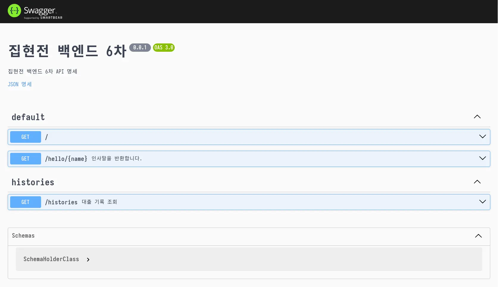

# backend-nest

6차 개발팀은 nestjs 로 새로 작성하기로 했습니다

## 개발 환경 설정

### 환경 변수

[.env.example](./.env.example)의 내용을 참고하여 루트 디렉토리에 `.env` 파일을 생성합니다.

### 백엔드

```sh
$ brew install corepack
$ corepack enable
```

[corepack](https://github.com/nodejs/corepack?tab=readme-ov-file#how-to-install)으로 pnpm을 설치합니다.

> [!NOTE]
> mac OS 환경에서는 `corepack` 패키지가 `yarn`과 `pnpm` 패키지와 충돌이 있을 수 있습니다.
> 이 경우 두 패키지를 모두 삭제하고 `corepack`을 설치해야 합니다.

```sh
$ pnpm install
```

프로젝트 의존성을 설치합니다.

### DB

```sh
$ docker compose -f compose-dev.yml up --remove-orphans
# (다른 터미널에서)
$ docker compose -f compose-dev.yml exec database /bin/sh
# mysql -h 127.0.0.1 -P 3306 -u root -p
mysql> use jip_serv;
mysql> source /내려받은/DB/덤프/파일/경로.sql;
```

초기 실행 시 [DB 덤프 파일](https://discord.com/channels/1277878039090565139/1277878039593619468/1278599701532377088)을 사용해 [데이터베이스를 초기화해야 합니다.](https://stackoverflow.com/questions/17666249/how-to-import-an-sql-file-using-the-command-line-in-mysql)

```
mysql> show databases;
+--------------------+
| Database           |
+--------------------+
| information_schema |
| jip_serv           |
| performance_schema |
+--------------------+
3 rows in set (0.01 sec)
```

다음과 같이 데이터베이스가 생성되어 있는지 확인합니다.

### docker compose 실행

```sh
$ pnpm dev
```

위 명령어로 개발용 docker compose를 실행합니다.



<http://localhost:3000/api> 경로에 접근하여 API 명세가 올바르게 표시되는지 확인합니다.
